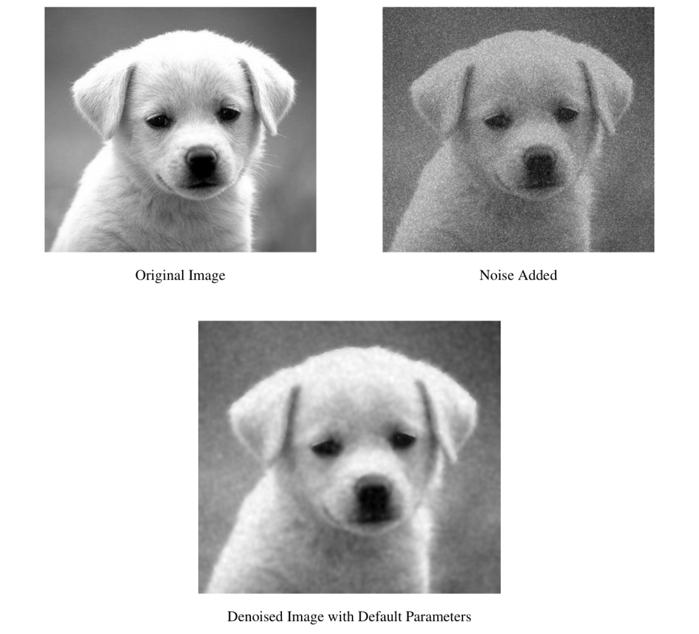
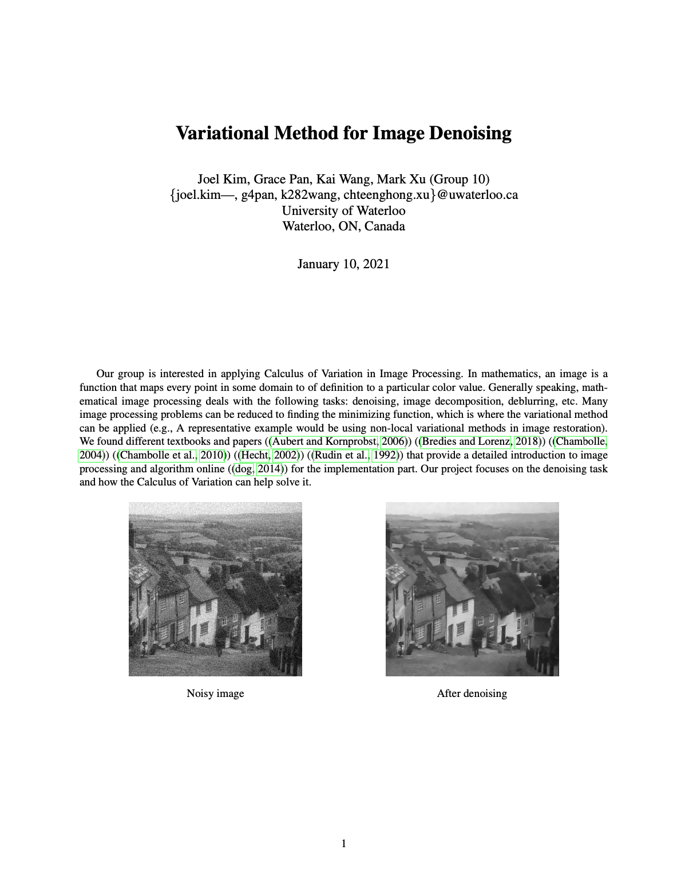
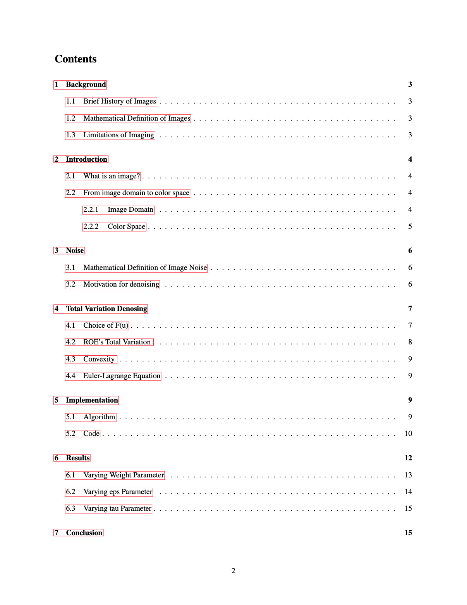

# Image_Denoising
A project to introduce image denoising using Calculus of Variation], including math theories and Python implentation. \
See the report [here](Amath456_Project.pdf). \
See the Python code in this [Jupyter Notebook](AMath-456-Project-Code-Jupyter-Notebook.ipynb). \

  
   

